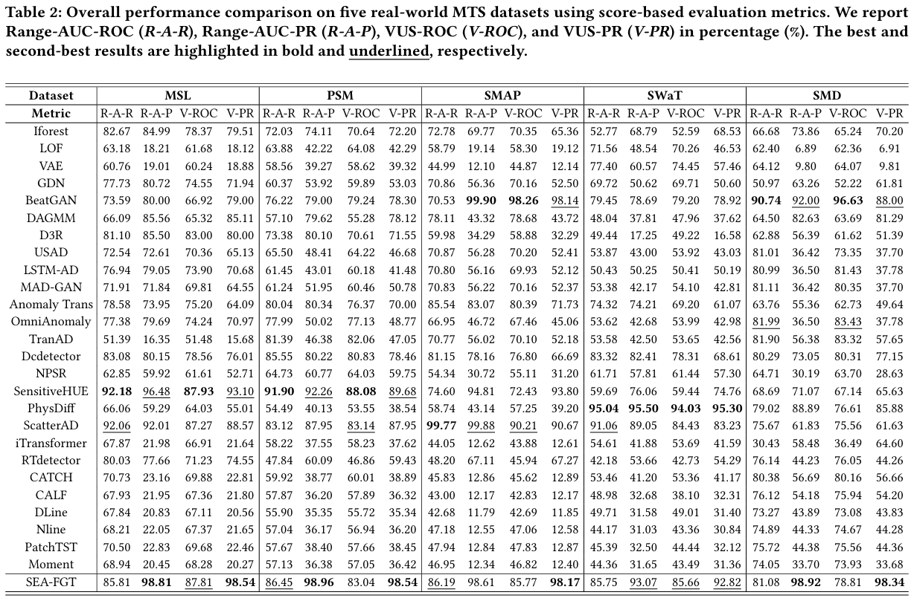
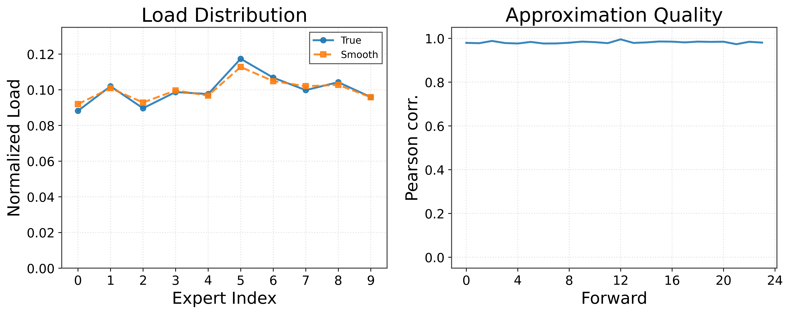

## More Analysis

In the fold, more results and analysis is presented.

### More Details

#### 1. Settings about Info-FGT

To ensure a fair comparison between SEA-FGT and InfoTS, we implement an InfoTS-based variant within the SEA-FGT framework, referred to as **Info-FGT**. 

Specifically, we replace SEA with the InfoTS meta-learner, which linearly combines predefined augmentation operators under an information-theoretic objective. Meanwhile, the expert load-balancing regularization used in SEA is substituted with the InfoNCE loss adopted in InfoTS. The other architectural components, optimization settings, and regularization weights are kept identical to those in SEA-FGT.

#### 2. Implement Details

In the CCE module, the frequency spectrum of each channel is partitioned into bands with a uniform band size of $|\mathcal{B}_b| = 6$. Since the number of channels varies across datasets, the k-sparse setting is adjusted accordingly for each dataset.

> To get more ideal performance, fine-tuning the threshold is necessary — which is the biggest drawback of current threshold-dependent methods. Perhaps threshold-free approaches are worth considering.

#### 3. Different Semantic Experts Settings

The architectural designs and parameter settings of the semantic expert networks used in our experiments are summarized in the table below. Each expert is designed with comparable model capacity while capturing distinct inductive biases.

| **Expert Type**      | **Layer Type**       | **#Layers** |
|----------------------|----------------------|-------------|
| Conv-MLP             | 1D Dilated Conv      | 3           |
|                      | MLP                  | 1           |
| MLP                  | MLP                  | 2           |
| Conv                 | 1D Conv              | 3           |

### Additional Experiments

#### 1. Complete Experimental Results (Table 2 from the main paper)

The full experimental results corresponding to Table 2 in the main paper are shown below.

#### 2. Approximation of Expert Utilization

The following figure compares the discrete expert usage with the proposed smoothed load estimator. The left panel shows the normalized expert loads, where the smoothed estimates closely match the true discrete usage. The right panel reports the Pearson correlation across routing instances, which remains consistently high, indicating that the proposed estimator provides a reliable approximation throughout training.

